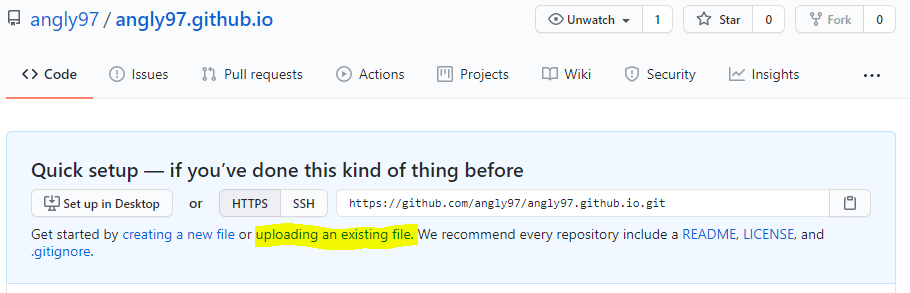

# Github

### ▣ Github 기능

* Code 저장 기능

* Undo 기능

* 협업 기능

* Web Hosting 기능 

  * 웹 배포
  * 웹 서비스를 위한 서버 기능

  

### ▣ Web Hosting

1. 저장소 이름 설정

   {: width="50%" height="50%"}
   
   
   
2. 파일 업로드
   {: width="50%" height="50%"}

   

3. index.html

   * 제일 첫 화면

   * 깃허브를 통해 배포 시, index.html이 어디있는지 먼저 검사

   * 필요한 파일 전부 드래그하여 업로드
   {: width="50%" height="50%"}

4. 페이지 배포 확인
   * Settings → GitHub Pages
   {: width="50%" height="50%"}

