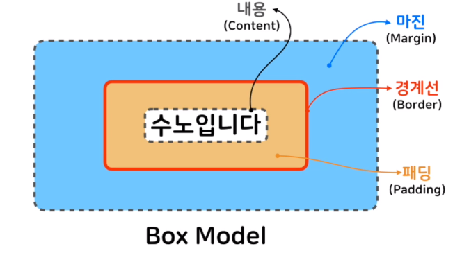
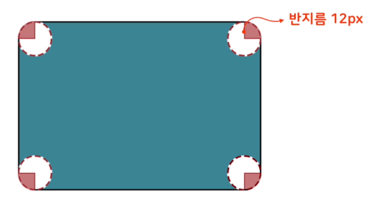

# [CSS] 박스모델


### ▣ 개념

* HTML의 모든 요소는 상자 형태를 가짐


### ▣ 구성



* 마진 (Margin)

  * 경계선 밖 여백
  * **앞으로는 늘 body 태그 margin을 0으로 초기화**

    ```html
    body {
      background-color: skyblue;
	     margin: 0;
    }
    ```

* 경계선(Border)

  * 속성

    * border-style	→	선 종류 지정 (시계방향 순; 위 오른쪽 아래 왼쪽)

      ```html
      <!-- 4면이 모두 직선 끊긴 선 -->
      border-style: dashed
      
      <!-- 위 아래 = dashed & 양 옆 = solid -->
      border-style: dashed solid
      
      <!-- 위 = dashed & 양 옆 = solid & 아래 = double -->
      border-style: dashed solid double
      
      <!-- 위 = dashed & 오른쪽 = solid & 아래 = double & 왼쪽 = dotted -->
      border-style: dashed solid double dotted
      ```

    * border-width	→	선 굵기

      ```html
      border-width: 20px 8px 10px;
      ```

    * border-color

      ```html
      border-color: red blue;
      ```

    * 한 번에 설정하는 법

      ```html
      border: 4px solid lemonchiffon;
      ```

    * border-radius	→	모서리 둥굴게

      > border-top-left-radius: 10px
      >
      > border-top-right-radius: 30px 10px (가로 세로)
      >
      > border-bottom-left-radius
      >
      > border-bottom-right-radius

      ```html
      border-radius: 12px;
      ```

      

      

* 패딩(Padding)

  * 경계선과 내용 사이 여백

    ```html
    padding: 20px;
    ```

* 내용 (Content)

  * width, heigh로 조절하는 부분
  * 내용 안의 글이 너무 많으면 내용 박스를 넘기기도 함 
    * 이때 overflow 속성 설정

  ```html
  #inner {
  	<!-- 내용 관련 스타일 -->
  	width: 200px;
  	height: 100px;
  
  	<!-- 내용~경계선까지 색 -->
  	background-color: pink;
  
  	<!-- 내용이 넘어가면 그 내용 짤려서 안보이게 
  		 내용이 넘어가면 스크롤 생성  			-->
  	overflow: hidden;
  	overflow: scroll;
  }
  ```

  

### ▣ Padding과 Margin  

* Padding

  * 경계선 내부 여백

  * 4방향을 따로 정의 가능

    ```html
    padding: 24px 12px 33px 12px;
    padding: 24px;
    ```

* Margin

  * 경계선 외부 여백
  * 4방향을 따로 정의 가능
  * 요소 간 간격 설정 가능
  * 마진 상쇄
    * 상하로 인접한 요소의 마진은 두 마진 중 더 큰 마진만 남게 됨

* Box sizing
  * width, heigh 설정이 어디에 적용되는지 결정
  * box-sizing: content-box;
    * 내용 박스에 적용
    * 패딩 값 늘리면 전체적으로 더 커짐
    * width/height = content size
  * box-sizing: border-box;
    * 경계선 두께까지 포함하여 안쪽 크기
    * 패딩 값 늘리면 전체적으로는 그대로 & 내용 박스 축소됨
    * width/height = content size + padding + border
