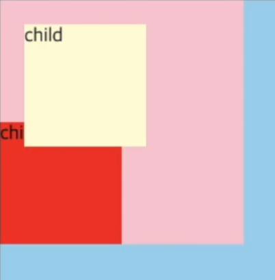
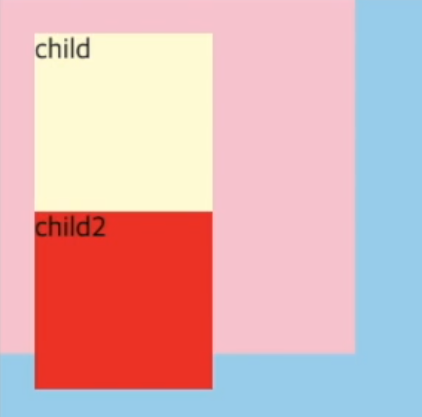
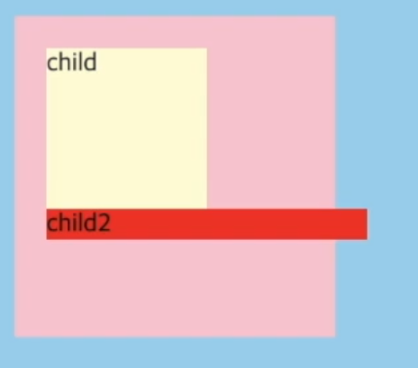
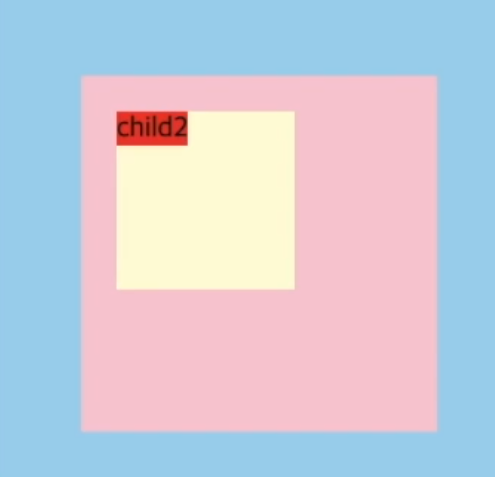
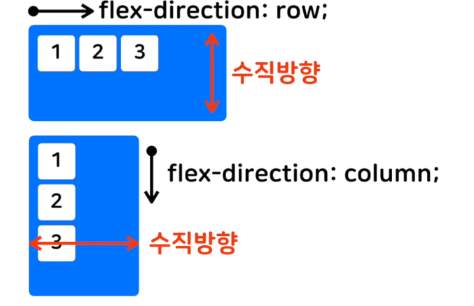
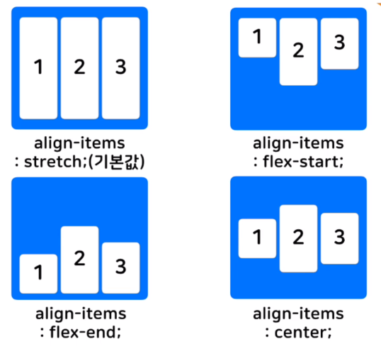
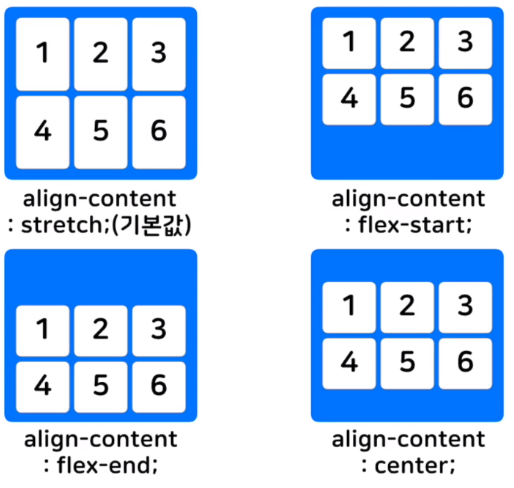
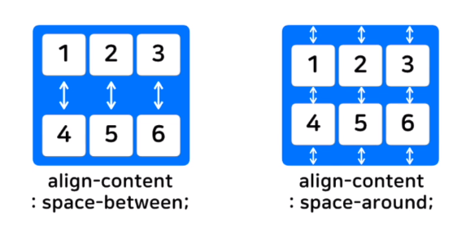

# [CSS] 위치와 관련된 프로퍼티


### ▣ Display

* 요소가 보여지는 방식 지정
* block 요소
  * 항상 새로운 줄에서 시작
  * 너비 100%
  * display: block;
  * ex. div / h1~h6 / p / header / secion ...
  * 프로퍼티	→	width, height, margin, padding 가능
* inline 요소
  * 새로운 줄에서 시작 x
  * 너비는 필요한 만큼만
  * diplay: inline;
  * ex. a / span / img ...
  * 프로퍼티	→	width, height, margin-top, margin-bottom **불가능**

* display: inline-block;
  * inline과 block의 특징을 모두 가짐
  * 새로운 줄에서 시작 x
  * 너비는 필요한 만큼만
  * 프로퍼티	→	width, height, margin-top, margin-bottom **가능**

* display: none;
  * 해당 요소 출력 안함


### ▣ Position

* 요소의 위치를 정의

* 값

  * static

    * 기본 값

    * 좌표 프로퍼티 사용 불가능

      

      ```html
      <!-- top, left 위치 이동 지정 변화 없음 -->
      #child1{
          position: relative;
          top: 20px;
          left: 20px
      }
      
      #child2{
          position: static;
          top: 20px;
          left: 20px
      }
      ```

  * relative

    * 상대위치

    * 기본 위치를 기준으로 좌표 프로퍼티를 통해 이동
      

      ```html
      <!-- top, left 위치 이동 지정 변화 -->
      #child1{
          position: relative;
          top: 20px;
          left: 20px
      }
      
      #child2{
          position: relative;
          top: 20px;
          left: 20px
      }
      ```

      

  * absolute

    * 부모나 조상 중 relative, absolute, fixed가 선언된 곳을 기준으로 좌표 이동
    * 부모가 움직이면 얘도 같이 움직임
    * static 이나 relative 는 블록 요소처럼 작용 (child2 주목)
      
    * absolute는 인라인-블록 요소처럼 작용 (child2 주목)

      

  * fixed

    * 보이는 화면을 기준으로 좌표를 통해 위치 고정
    * ex. 스크롤을 해도 따라 다니는 메뉴 등

  * z-index

    * 우선순위 값이 클수록 전면에 등장

    * static을 제외한 요소에서 사용

      ```html
      <!-- front가 앞으로 나옴 ; 2>1 -->
      #front {
      	background-color = pink
      	height = 100px
      	width = 100px
      	
      	z-index = 2
      }
      #back {
      	background-color = yellow
      	height = 100px
      	width = 100px
      	
      	z-index = 1
      }
      ```

      

### ▣ flexbox

- 가로/세로 방향으로 정렬

- 구성

  - flex container (부모 요소)
  - flex item (자식 요소)

- 사용법

  - 정렬하고자 하는 요소의 부모요소(flex container)에 display: flex; 추가

- 부모 요소에서 쓰이는 속성

  - flex-direction

    - flex 컨테이너 안의 iteml 들 방향 결정

    - 값

      1. 기본값 =  row	→	왼쪽에서 오른쪽
      2. row-reverse	→	오른쪽에서 왼쪽
      3. column			→	위에서 아래
      4. column-reverse		→	아래에서 위		

      ```html
      <!-- 1. display:flex; 추가 			=> item 들이 row로 정렬됨(왼->오) 
      	 2. flex-direction: colum; 추가 	=> 다시 item 들이 column으로 정렬됨(위->아래) -->
      <head>
          #container{
          	background-color = skyblue;
          	display: flex;
          	flex-direction: colum;
          }
          .item{
          	background-color =pink;
          	width = 36px;
          	height = 36px;
          }
      </head>
      
      <body>
          
          <div id = "container">
              <div class = "item">1</div>
              <div class = "item">2</div>
              <div class = "item">3</div>
          </div>
          
      </body>
      ```

  - flex-wrap

    - flex 아이템이 flex 컨테이너를 벗어났을 때 줄을 바꾸는 속성

    - 값

      1. nowrap	→	속성을 주지 않음

      2. wrap		→	줄을 바꿔줌	

      ```html
      <!-- 1. flex-wrap: nowrap; 추가 			=> 아이템들이 컨테이너 뚫고 나옴
      	 2. 1번 주석 & flex-wrap: wrap; 추가 	=> 아이템들이 컨테이너 안에서 다음 열/행로 이동 -->
      <head>
          #container{
          	background-color = skyblue;
          	display: flex;
          	<!-- 2.flex-wrap: nowrap; -->
          	flex-wrap: wrap;
          }
          .item{
          	background-color =pink;
          	width = 36px;
          	height = 36px;
          }
      </head>
      
      <body>
          
          <div id = "container">
              <div class = "item">1</div>
              <div class = "item">2</div>
              <div class = "item">3</div>
              <div class = "item">4</div>
              <div class = "item">5</div>
              <div class = "item">6</div>
              <div class = "item">7</div>
          </div>
          
      </body>
      ```

  - 한번에 설정하기

    ```html
        #container{
        	background-color = skyblue;
        	<!-- display: flex;
        	flex-wrap: wrap;	-->
    
    		flex-flow: row wrap
        }
    ```

  - justify-content

    - flex-direaction으로 정해진 방향으로 item 정렬

    - 값

      1. flex-start	→	왼쪽부터 정렬

      2. center		→	가운데 정렬	

      3. flex-end	→	오른쪽부터 정렬
      


      4. space-around	→	시작과 끝에 간격을 두고 동일한 간격으로 item 배치

      5. space-between	→	시작과 끝에 item 두고 동일한 간격으로 item 배치

      
      

  - align-items

    - flex-direaction으로 정해진 방향의 수직으로 item 정렬
      
    - 값
      1. stretch (기본 값)	→	늘려서 맞춰줌
      2. flex-start	→	시작부터
      3. flex-end	→	끝부터
      4. center	→	가운데에 맞춰줌
      

  - align-content

    - flex-direction으로 정해진 방향의 수직으로 여러 줄인 item 정렬
    - 값
      1. stretch (기본 값)
      2. flex-start
      3. flex-end
      4. center
      

      5. space-between
      6. space-around

      

- 자식 요소에서 쓰이는 속성

  - flex-grow

    - flex 아이템의 확장과 관련된 속성

    - 0 (기본 값)	→	flex 컨테이너 크기에 무관

    - 1,2,3 ...		 →	더 큰 숫자가 더 많은 비율로 flex 컨테이너 크기를 꽉 채움

      ```html
      #container{
      	width = 300px;
      	height = 300px;
      	
      	display: flex;
      	flex-direction: row;
      }
      .item{
      	width = 60px;
      	height = 60px;
      }
      
      <!-- 전체 300px 중 아이템이 3개니까 60px*3=180px 제외하고,
      	 남은 120px을 2:1로 나눠 80px과 40px를 각각 two, one에게 부여
      	 결과적으로 one은 100px, two는 120px						-->
      #one{
      	flex-grow: 1
      }
      #two{
      	flex-grow: 2
      }
      #three{
      	flex-grow: 0
      }
      
      <body>
          <div id = "container">
          	<div id = "one" class = "item">1</div>
          	<div id = "two" class = "item">2</div>
          	<div id = "three" class = "item">3</div>
          </div>
      </body>
      ```

  - flex-shrink

    - flex 아이템의 축소와 관련된 속성
    - 1 (기본 값), 2, 3...	 →	아이템의 크기 > 컨테이너 면, 컨테이너 크기에 맞게 축소됨
    - 0								→	아이템의 크기 > 컨테이너 여도, 아이템은 컨테이너 뚫고 나오지 축소는 X

  - flex-basis

    - flex 아이템의 기본크기를 결정
    - auto (기본 값)

  - flex

    - flex-grow, flex-shrink, flex-basis 를 한번에 설정

      ```html
      <!-- flex-grow: 1, flex-shrink:0, flex-basis:auto -->
      flex: 1 0 auto
      
      <!-- flex-grow: 1, flex-shrink:1 -->
      flex: 1
      ```

      
