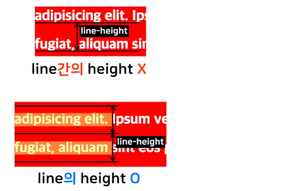

# [CSS] 텍스트와 관련된 프로피터


### ▣ 폰트와 관련된 프로피터

* font-size

  * 폰트 크기

* font-family

  * 글꼴

  * 한 단어로 된 폰트 이름은 그냥 적기

  * 두 단어 이상의 폰트 이름은 '폰트 이름' 으로 적기

  * 폰트 종류를 여러개 지정

    * 앞에 폰트가 없으면 그 다음 폰트로 지정

    * 따라서 항상 마지막 폰트는 모든 OS에 있는 일반 글꼴 적용

      ```html
      <!-- cursive는 일반 글꼴 -->
      font-family: 'Cute Font', Arial, cursive;
      ```

  * 웹 폰트

    * font-by

      * 웹에서 링클르 통해 폰트 불러옴

      * 방법

        1. Google Fonts 접속해 원하는 폰트 선택

        2. link 태그 있는 코드 복사 후 head 태그 내에 붙여넣기

        3. CSS로 코드 적용 (font-family: "폰트 이름")

           ```html
           <head>
               <link rel="preconnect" href="https://fonts.gstatic.com">
               <link href="https://fonts.googleapis.com/css2?family=Gaegu:wght@300&display=swap" rel="stylesheet">
               
               <style>
                   #p {
                       font-family: 'Gaegu', cursive;
                   }
               </style>
           </head>
           ```

* font-style

  * 값

    * normal	→	기본 글씨

    * italic		→	이텔릭체가 디자인 된 폰트만 기울임

    * oblique	→	무조건 기울임

      ```html
      <head>
      	<style>
              #p {
                  font-family: 'Gaegu', cursive;
                  font-style: italic;
              }
          </style>
      </head>
      ```

* font-weight

  * 폰트 굵기 지정

  * 값

    * bold

    * 100~900 사이 숫자	→	normal == 400 , bold == 700

      ```html
      <head>
          <style>
              #p {
                  font-family: 'Gaegu', cursive;
                  font-style: italic;
                  font-weight: 900;
              }
          </style>
      </head>
      ```

* 한 문장으로 지정하는 법

  * 띄어쓰기로 각 속성 구분

    ```html
    font: oblique 900 35px 'Gaegu', cursive;
    ```

  

### ▣ 텍스트 정렬과 관련된 속성

* text-align

  * 텍스트를 좌, 중앙, 우 정렬

  * 본인 요소를 기준으로 정렬

  * 값

    * left, center, right

      ```html
      <head>
      	<style>
              #p { text-align: center; }
          </style>
      </head>
      ```

* line-height

  * 문장 사이의 간격 조정

    

  * 값

    * 숫자 만!!	→	폰트 크기 기준으로 n배
    * 숫자px	→	폰트 크기 기준으로 px만큼

* letter-spacing

  * 글자 간 간격 조정
  * 값
    * px

* text-indent

  * 문단 시작부의 들여쓰기 
  * 값
    - px

