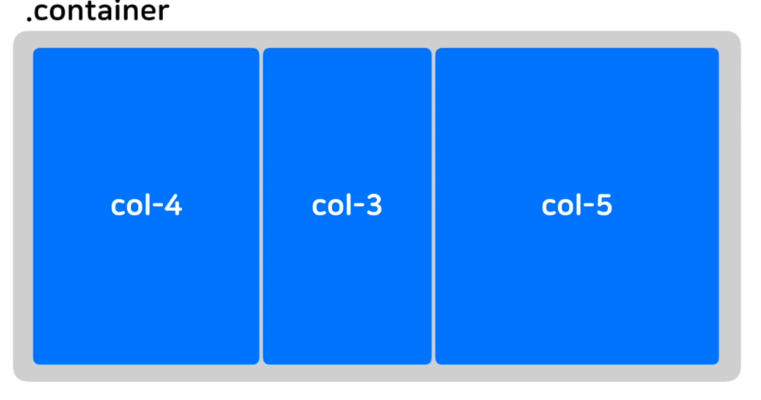
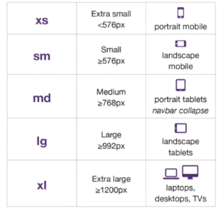

# 부트스트랩

> 클래스 기반
>
> →	다른 스타일을 덮어 씌우고 싶으면 우선순위가 높은 
>
> ​		!important, id, div.class 를 사용
>
> cf. 클래스는 여러개 적용 가능 
>
> ```html
> <button class = "class1 class2">
>     ...
> </button>
> ```


### ▣ 부트스트랩 사용법

1. 검색창 "Bootstrap" 입력 후 사이트 클릭
   * 영문 버전이 한글 버전보다 업뎃이 빨라서 추천
2. Get started 클릭
3. CSS 코드 head 태그 안에 복붙 & JS코드 body 종료 태그 위에 복붙


### ▣ 폼과 버튼

* 폼
  * Bootstrap 페이지 검색창에 "form" 검색 후 원하는 코드 복붙
* 버튼
  * Bootstrap 페이지 검색창에 "button" 검색 후 원하는 코드 복붙


### ▣ 그리드 시스템

* container와 row가 반드시 필요
* Bootstrap 페이지 검색창에 "grid" 검색 후 원하는 코드 복붙
* 컨테이너를 12개로 나눔
* .col - n
  * 12등분 중 n개만큼의 너비
 
     

* 반응형 웹 가능

  * .col-화면사이즈-n

    * 화면 사이즈

     
